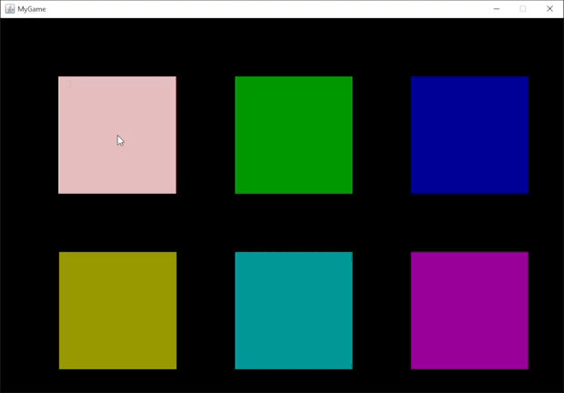
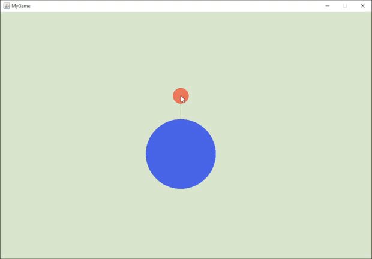
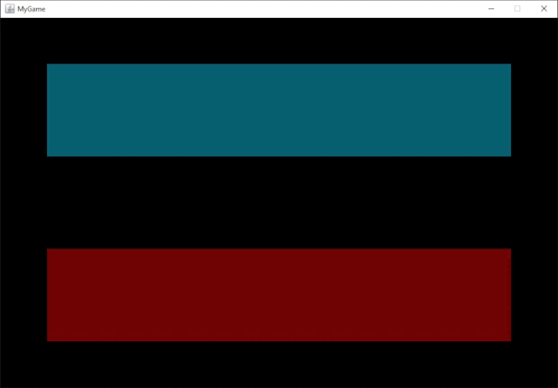

# Java-2D-Game-Engine-OLD
This repository was created to serve as a backup for my local project, Java 2D Game Engine.

---
## Here are some glimpse of what this engine can do:

* ### Full texture and primitives rendering capabilities
  

* ### Alpha blending
  

* ### Spring Force Simulation
  

* ### Newtonian Gravity Simulation
  
